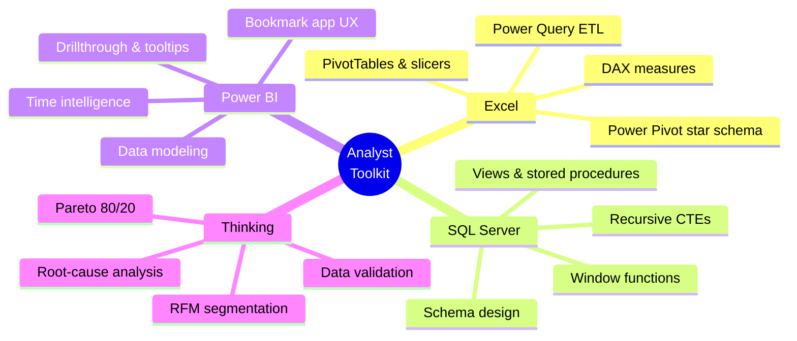
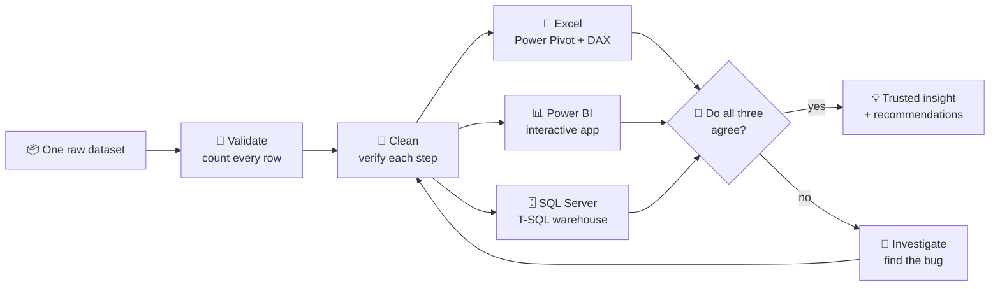
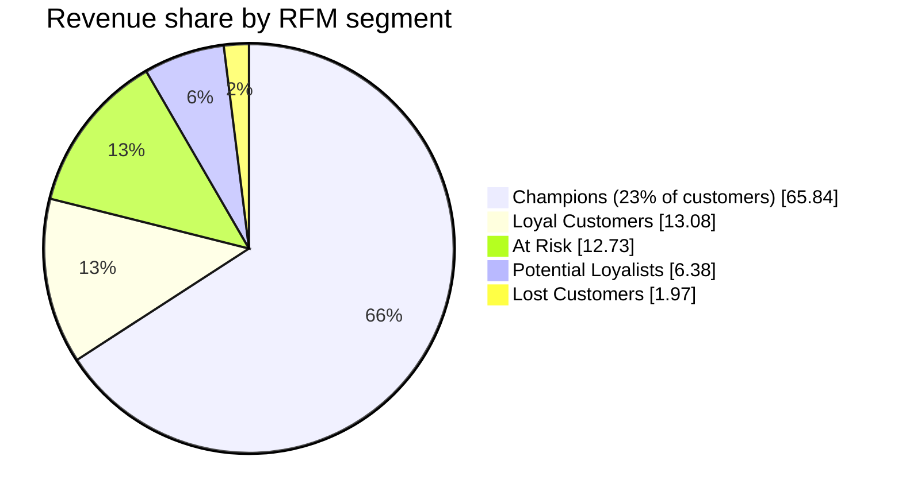

<!-- ═══════════════════════════  HERO  ═══════════════════════════ -->

 

 

  

**[⚡ TL;DR](#-recruiter-tldr)** · **[🧭 Approach](#-my-signature-approach)** · **[🏆 Projects](#-featured-projects)** · **[🔬 Cross-Validation](#-cross-tool-validation)** · **[🐞 Bugs I Caught](#-bugs-i-caught-and-fixed)** · **[🗺️ Roadmap](#️-roadmap)** · **[🤝 Connect](#-lets-connect)**

---

## ⚡ Recruiter TL;DR

> [!TIP]
> **30-second version:** I'm a Data Analyst (Excel · SQL Server · Power BI · DAX · Power Query) who builds each project **end to end** — raw CSV → validated, cleaned data → star schema → analysis → business recommendations — and then **rebuilds it in a second and third tool to check the answer.**

| 🎯 What I deliver | 📊 Proof (from my projects) |
|---|---|
| Customer segmentation that finds the money | **23% of customers = 65.84% of revenue** across 541K transactions |
| Diagnosis, not just dashboards | Found **why** profit fell while sales grew: **$322K in discounts > $286K total profit** |
| Data I can defend | Row counts verified at **every** cleaning step: 541,909 → 401,560 |
| Judgment on messy data | Caught a **partial-month artifact** and a **bulk-order-then-cancel** anomaly before they reached a report |

---

## 👤 About

| | |
|---|---|
| 🎓 **Education** | B.E. Computer Science Engineering (VTU) |
| 🏅 **Certified** | Google Data Analytics Professional Certificate (Dec 2025) |
| 📍 **Based in** | Belagavi, India |
| 🎯 **Targeting** | Data Analyst · Business Analyst · Power BI Developer · MIS Executive |
| 🐍 **Learning** | Python for advanced analytics |
| 🧠 **Working style** | Count first. Clean second. Cross-check always. Document the bugs. |

---

## 🛠️ Tech Stack

  

  
  
  
  
  
  

---

## 🧭 My Signature Approach

**Most portfolios build a project once. I rebuild the same business problem in three tools.** When three independent pipelines — built with different techniques — land on the same answer, that's validation no single tool can give you.

---

## 🏆 Featured Projects

| # | Project | Tools | Status |
|:-:|---|---|:-:|
| 1 | [**Customer Segmentation & Revenue Intelligence**](#1️⃣-customer-segmentation--revenue-intelligence) | Excel · Power BI · SQL Server | ✅ Completed |
| 2 | [**Superstore Sales — Why Did Profit Decline?**](#2️⃣-superstore-sales-analysis--why-did-profit-decline) | Excel · Power BI · SQL Server | ✅ Completed |
| 3 | [**HR Analytics — Employee Attrition**](#3️⃣-hr-analytics--employee-attrition) | Power BI | 🚧 Coming Soon |

---

## 1️⃣ Customer Segmentation & Revenue Intelligence

  
  
  
  

🗓️ **Timeline:** `<start date>` → `<end date>`

### 📈 Impact at a glance

| 💰 Revenue | 👥 Customers | 🏆 Concentration | ⚠️ Churn | 🚨 Revenue at risk |
|:-:|:-:|:-:|:-:|:-:|
| **£8.89M** gross £8.28M net | **4,371** 5 RFM segments | **23%** of customers drive **65.84%** of revenue | **33.9%** inactive 90+ days | **£1.3M+** At Risk + Lost |

<b>📖 Case study — Situation · Task · Action · Result</b>

 

| | |
|---|---|
| **🧩 Situation** | A UK online retailer had 13 months of transactions and no clear view of who its valuable customers were, or who was about to leave. |
| **🎯 Task** | Segment customers by behavior (RFM), size the revenue at risk, and say where to spend retention effort. |
| **⚙️ Action** | Cleaned 541,909 rows → 401,560 with a verified count at every step; modeled a star schema; scored Recency/Frequency/Monetary in 1–5 quintiles; classified into 5 mutually exclusive segments; rebuilt it independently in 3 tools. |
| **🏁 Result** | Champions drive two-thirds of revenue; **34% of customers bought once and never returned** (a retention gap, not an acquisition gap); **£1.3M+** sits with disengaging customers; a 20% win-back would recover ≈ **£265K**. |

### 🧩 Pick a version

<b>📗 Excel</b> — Power Query · Power Pivot · DAX

 

- **5-table star schema** in Power Pivot, **20+ DAX measures** (CLV, churn, retention, RFM scoring)
- Two slicer-driven dashboards + a dedicated **EDA** sheet + a **Business Insights & Actions** page (Finding → Insight → Action)

🔗 [View project](https://github.com/shivanand-Mathapati-Analyst/customer-segmentation-analysis)

<b>📊 Power BI</b> — a single-page "app", not a stack of tabs

 

- **Bookmark-driven app:** fixed sidebar + persistent global slicers + **5 swappable views**
- **49 DAX measures** — `RANKX` scoring, Pareto curves, DAX-generated insight sentences
- **Drillthrough** customer page + **2 custom tooltip pages**; hand-built dark *"Obsidian & Amber"* theme

🔗 [View project](https://github.com/shivanand-Mathapati-Analyst/YOUR-POWERBI-CUSTOMER-SEGMENTATION-REPO) · 🌐 [Live report](https://YOUR-POWER-BI-SERVICE-LINK)

<b>🗄️ SQL Server</b> — T-SQL warehouse + reporting layer

 

- **3-schema design:** `original` → `datamodel` → `reporting`
- **`NTILE(5)` RFM engine**, **recursive-CTE** calendar table, **26 views + 2 stored procedures**
- Fully commented script ending in written *Findings → Root Causes → Insights → Recommendations*

🔗 [View project](https://github.com/shivanand-Mathapati-Analyst/YOUR-SQL-CUSTOMER-SEGMENTATION-REPO)

---

## 2️⃣ Superstore Sales Analysis — *Why Did Profit Decline?*

  
  
  

🗓️ **Timeline:** `<start date>` → `<end date>`

| 💰 Scale | 📉 The paradox | ⚠️ The leak | 🏷️ The cause |
|:-:|:-:|:-:|:-:|
| **$2.30M** sales **$286K** profit | Margin **13.4% → 12.7%** while sales grew 20%+ | **26.3%** of orders (1,318 / 5,009) lost money | **$322.58K** in discounts — *more than total profit* |

- 📉 **Discounts above 30% turn margin negative**; above 50% it hits **−119%**
- 🪑 **Furniture (Tables & Bookcases)** is structurally unprofitable despite the highest average discount
- 🗺️ Texas, Ohio, Colorado, Illinois and Pennsylvania drive most losses

<b>🧩 Excel · Power BI · SQL Server versions</b>

 

| Version | Highlights | Link |
|---|---|---|
| 📗 **Excel** | MoM & YoY analysis, 12+ KPIs, slicer dashboard — reporting time cut from hours to minutes | [Repo](https://github.com/shivanand-Mathapati-Analyst/excel-superstore-sales-analysis) |
| 📊 **Power BI** | 6 pages + 3 tooltip pages, 50+ DAX measures, dynamic titles & DAX-written insight callouts | [Repo](https://github.com/shivanand-Mathapati-Analyst/powerbi-sales-analysis-project) |
| 🗄️ **SQL Server** | The same business problem in native T-SQL | [Repo](https://github.com/shivanand-Mathapati-Analyst/sql-superstore-sales-analysis) |

---

## 3️⃣ HR Analytics — Employee Attrition

  
  
  

🧠 **The question:** *Why do employees leave — and who is most likely to go next?*

| 🔭 Planned focus | What it will answer |
|---|---|
| **Attrition drivers** | Which factors (overtime, tenure, income, role, satisfaction) most strongly predict leaving? |
| **Workforce risk** | Which departments and roles carry the most attrition exposure? |
| **Employee profile** | What does a flight-risk employee look like versus a retained one? |
| **Actionable levers** | Where can HR intervene for the biggest retention impact? |

> [!NOTE]
> Designed to cover the full breadth of Power BI — and to look unlike a typical portfolio dashboard. **Star this repo to follow along.**

---

## 🔬 Cross-Tool Validation

Same dataset, same methodology, **built independently** — here's how the Customer Segmentation numbers line up:

| Metric | 📗 Excel | 🗄️ SQL Server | 📊 Power BI |
|---|:-:|:-:|:-:|
| Total customers | 4,371 | 4,371 | 4,371 |
| Gross revenue | £8.89M | £8.89M | `[fill in]` |
| Net revenue (after returns) | £8.28M | £8.28M | `[fill in]` |
| Champions — customers | 1,009 | 1,009 | `[fill in]` |
| Champions — share of revenue | 65.84% | 65.84% | `[fill in]` |
| Churn rate (90+ days inactive) | 33.91% | 33.9% | `[fill in]` |

> Tiny differences (e.g. ±1 customer at a segment boundary) come from tie-breaking in each tool's ranking logic — and are documented, not hidden.

---

## 🐞 Bugs I Caught and Fixed

<b>The real problems I hit while building — and how I diagnosed them</b>

 

| 🐛 Bug | 🔍 How I found it | 🛠️ Fix |
|---|---|---|
| **UK dates misread** — `ALTER COLUMN` to `DATETIME` failed with "out-of-range" | Raw dates are `dd-mm-yyyy`; the server assumed `us_english` | `SET DATEFORMAT dmy` before casting |
| **Customers silently dropped** — 33 customers had `NULL` RFM values | A `NULL` check returned 33, not 0; they only had cancelled orders | `INNER JOIN` → `LEFT JOIN` + `COALESCE` fallbacks |
| **Return-only customers scored as "Potential Loyalists"** in Power BI | DAX `RANKX` sorts `BLANK()` as the smallest value → accidental top Recency score | Gave blank-Recency customers an honest worst-case value |
| **Inflated revenue %** in a SQL view | Joined a customer-level `Monetary` to the fact table → summed once per transaction (fan-out join) | Aggregate customer-level fields from the dimension, with no join |
| **Segment counts impossible** (Lost + At Risk > R≤2 pool) | Pool-size arithmetic didn't add up | A `>=` typo that should have been `<=` |
| **Duplicates left in Power BI** | Cross-tool row count disagreed with SQL | Added a de-duplication step upstream |
| **#1 product was a mirage** | Same SKU topped both "best-selling" and "most-returned" at 80,995 units | One customer bought and fully cancelled it — flagged, not ranked |
| **December "collapse"** | Dataset ends 9 Dec — a partial month | Footnoted as a data-boundary artifact |

---

## 🗺️ Roadmap

- [x] Customer Segmentation — Excel · Power BI · SQL Server
- [x] Superstore Sales Analysis — Excel · Power BI · SQL Server
- [ ] 🚧 HR Analytics — Employee Attrition (Power BI)
- [ ] 🚧 *Midnight Analytics* — executive dashboard (Tableau)
- [ ] 🐍 Python for advanced analytics — EDA & automation

---

## 🎓 Certification

  
  
  

📚 Data Cleaning · EDA · SQL · Visualization · Capstone · 🛠️ Excel, SQL, Tableau, R · 🔗 [View credential](https://coursera.org/share/c9135167c520baa7ddaad2d78e86b0df)

---

## 📊 GitHub Activity

  <picture>
    <source media="(prefers-color-scheme: dark)" srcset="https://github-readme-stats.vercel.app/api?username=shivanand-Mathapati-Analyst&show_icons=true&theme=tokyonight&hide_border=true&count_private=true">
    <source media="(prefers-color-scheme: light)" srcset="https://github-readme-stats.vercel.app/api?username=shivanand-Mathapati-Analyst&show_icons=true&theme=default&hide_border=true&count_private=true">
    
  </picture>
  <picture>
    <source media="(prefers-color-scheme: dark)" srcset="https://github-readme-stats.vercel.app/api/top-langs/?username=shivanand-Mathapati-Analyst&layout=compact&theme=tokyonight&hide_border=true">
    <source media="(prefers-color-scheme: light)" srcset="https://github-readme-stats.vercel.app/api/top-langs/?username=shivanand-Mathapati-Analyst&layout=compact&theme=default&hide_border=true">
    
  </picture>

  

<!-- Contribution snake: requires the snake.yml workflow (included separately) to have run once -->

  <picture>
    <source media="(prefers-color-scheme: dark)" srcset="https://raw.githubusercontent.com/shivanand-Mathapati-Analyst/shivanand-Mathapati-Analyst/output/github-snake-dark.svg">
    <source media="(prefers-color-scheme: light)" srcset="https://raw.githubusercontent.com/shivanand-Mathapati-Analyst/shivanand-Mathapati-Analyst/output/github-snake.svg">
    
  </picture>

---

## 🤝 Let's Connect

  
  
  

### 🚀 Open to Data Analyst roles · internships · freelance · full-time

⭐ **Consistently learning, building & improving in Data Analytics** ⭐

