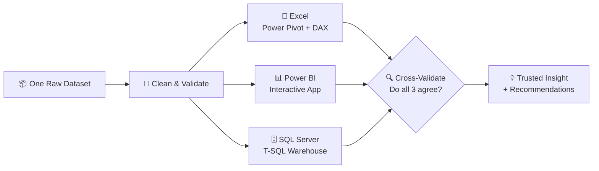

<!-- ═══════════════════════  HEADER BANNER  ═══════════════════════ -->

 

  

---

## 👋 Hi, I'm Shiva

> **Data Analyst** who turns messy, real-world data into clear business decisions — and then proves the answer holds up by rebuilding it in more than one tool.

| | |
|---|---|
| 🎓 **Education** | B.E. Computer Science Engineering (VTU) |
| 🏅 **Certified** | Google Data Analytics Professional Certificate |
| 📍 **Based in** | Belagavi, India |
| 🛠️ **Core Stack** | Excel · SQL Server · Power BI · DAX · Power Query · Tableau |
| 🐍 **Learning** | Python for advanced analytics |
| 🎯 **Targeting** | Data Analyst · Business Analyst · Power BI Developer · MIS Executive |
| 🧠 **I'm known for** | Catching the anomaly in the data *before* it ends up in a dashboard |

---

## 🛠️ Tech Stack

  

  
  
  
  
  
  

<b>🔍 What I actually do with each tool</b>

 

| Tool | Hands-on skills demonstrated in my projects |
|---|---|
| **Excel** | Power Query ETL, Power Pivot star schema, DAX measures, PivotTables, slicer-driven dashboards, advanced formulas |
| **SQL Server** | Schema design, data validation, window functions (`NTILE`, `ROW_NUMBER`, `RANK`), recursive CTEs, views, stored procedures |
| **Power BI** | Star-schema modeling, 50+ DAX measures, time intelligence, bookmark-driven app UX, drillthrough, custom tooltip pages |
| **Power Query (M)** | Type casting, de-duplication, derived columns, reference queries, dimension splitting |
| **Tableau** | Dashboard design and worksheets *(in progress — see roadmap)* |

---

## 🎓 Certification

  
  
  

📚 **Covered:** Data Cleaning · EDA · SQL · Data Visualization · Capstone Case Study  
🛠️ **Tools:** Excel, SQL, Tableau, R  
🔗 [View credential](https://coursera.org/share/c9135167c520baa7ddaad2d78e86b0df)

---

## 🧭 My Signature Approach: *One Question, Three Tools*

Instead of building a project once and moving on, I rebuild the **same business problem in Excel, Power BI, and SQL Server** — then compare the results. When three independent pipelines land on the same answer, that's validation no single tool can give you.

---

## ✨ Featured Projects

| # | Project | Tools | Status |
|:-:|---|---|:-:|
| 1 | [**Customer Segmentation & Revenue Intelligence**](#1️⃣-customer-segmentation--revenue-intelligence) — RFM analysis on 541K transactions | Excel · Power BI · SQL Server | ✅ Completed |
| 2 | [**Superstore Sales Analysis**](#2️⃣-superstore-sales-analysis--why-did-profit-decline) — growth without profitability | Excel · Power BI · SQL Server | ✅ Completed |
| 3 | [**HR Analytics — Employee Attrition**](#3️⃣-hr-analytics--employee-attrition-coming-soon) — why do employees leave? | Power BI | 🚧 Coming Soon |

---
 

## 1️⃣ Customer Segmentation & Revenue Intelligence

  
  
  
  
  

🗓️ **Timeline:** `<start date>` → `<end date>`

📊 Analyzed **541,909 retail transactions** (Dec 2010 – Dec 2011) to answer one question: *which customers actually drive the business, and which are about to leave?* Built **three times, independently** — and all three builds converged on the same answer.

### 💡 Impact — What Matters

| 💰 Revenue | 👥 Customers | 🏆 Concentration | ⚠️ Churn | 🚨 At Risk |
|:-:|:-:|:-:|:-:|:-:|
| **£8.89M** gross £8.28M net | **4,371** across 5 RFM segments | **23%** of customers drive **65.84%** of revenue | **33.9%** inactive 90+ days | **£1.3M+** revenue at risk |

- 🔁 **34% of customers bought exactly once** and never returned — the real gap is *retention*, not acquisition
- 📈 **Top 20% of customers = 74.85% of revenue**; top 1% (44 customers) = **32%** alone
- 🌍 **UK = ~82% of revenue** — functionally a UK-domestic business
- 🕵️ **Caught two data anomalies** instead of reporting them blindly: a partial final month (December ends on the 9th) and a bulk-order-then-cancel pattern (80,995 units) that falsely crowned a "best-selling" product

### 🧩 Choose a version

<b>📗 Excel Version</b> — Power Query · Power Pivot · DAX

 

- Designed a **5-table star schema** in Power Pivot
- Built **20+ DAX measures** (CLV, churn, retention, RFM scoring & segmentation)
- Delivered **two dashboards + a dedicated EDA sheet + a Business Insights & Actions page** (Finding → Insight → Action)
- Automated cleaning and transformation with **Power Query (M)**

🔗 [View Excel project](https://github.com/shivanand-Mathapati-Analyst/customer-segmentation-analysis)

<b>📊 Power BI Version</b> — A single-page "app", not a stack of tabs

 

- Built as a **bookmark-driven single-page app**: fixed sidebar navigation, persistent global slicers, and **5 swappable views** (Overview · Segmentation · Customers · Products · Insights)
- **49 DAX measures** — RFM scoring via `RANKX`, Pareto (80/20) curves, dynamic insight sentences generated by DAX
- **Drillthrough page** (customer-level detail with a dynamically color-coded segment card) + **2 custom report-page tooltips**
- Hand-built dark **"Obsidian & Amber"** theme with a consistent 5-color segment palette

🔗 [View Power BI project](https://github.com/shivanand-Mathapati-Analyst/YOUR-POWERBI-CUSTOMER-SEGMENTATION-REPO)  
🌐 [Live on Power BI Service](https://YOUR-POWER-BI-SERVICE-LINK)

<b>🗄️ SQL Server Version</b> — Full T-SQL warehouse + reporting layer

 

- **3-schema design** — `original` (raw, untouched) → `datamodel` (star schema) → `reporting` (views & procedures)
- Cleaned **541,909 → 401,560 rows** with a count-verified check at every step
- **RFM engine with `NTILE(5)`**, a **recursive-CTE date dimension**, and **26 views + 2 stored procedures**
- Documented real bugs found & fixed (date-locale mismatch, fan-out joins, NULL-ranking edge case) in a fully commented script with a written findings section

🔗 [View SQL Server project](https://github.com/shivanand-Mathapati-Analyst/YOUR-SQL-CUSTOMER-SEGMENTATION-REPO)

### 🎯 Outcome

Gave the business a clear, validated picture of **who to protect (Champions), who to win back (At Risk), and who to nurture (Potential Loyalists)** — with prioritized, revenue-backed recommendations rather than generic advice.

---
 

## 2️⃣ Superstore Sales Analysis — *Why Did Profit Decline?*

  
  
  
  

🗓️ **Timeline:** `<start date>` → `<end date>`

📊 Analyzed **9,994 transactions** to diagnose a real business problem: *sales grew every year, but profit margin stagnated and then declined.* Built across **Excel, Power BI, and SQL Server**.

### 💡 Impact — What Matters

| 💰 Sales | 📉 Margin | ⚠️ Loss-Making | 🏷️ Discounts |
|:-:|:-:|:-:|:-:|
| **$2.30M** sales **$286K** profit | **13.4% → 12.7%** despite 20%+ sales growth | **26.3%** of orders (1,318 of 5,009) unprofitable | **$322.58K** given away — *more than total profit* |

- 🪑 **Furniture (Tables & Bookcases)** is structurally unprofitable despite receiving the highest average discount
- 📉 **Discounts above 30% turn margin negative** — above 50% the margin hits **−119%**
- 🗺️ A handful of states (Texas, Ohio, Colorado, Illinois, Pennsylvania) drive the bulk of losses

### 🧩 Choose a version

<b>📗 Excel Version</b> — Interactive dashboard with slicers

 

- **MoM & YoY** sales analysis to track growth trends
- **12+ KPIs** (Revenue, Profit, AOV, Growth %) using advanced Excel formulas
- Slicer-driven dashboard with drill-down views — reporting time cut from **hours to minutes**

🔗 [View Excel project](https://github.com/shivanand-Mathapati-Analyst/excel-superstore-sales-analysis)

<b>📊 Power BI Version</b> — 6 pages + 3 tooltip pages

 

- **Star-schema model** with a custom date dimension and **50+ DAX measures** (YTD/QTD/MTD, YoY%, MoM%, rolling averages)
- **Dynamic page titles & auto-generated insight callouts** written entirely in DAX
- Full **root-cause analysis** with actionable recommendations — not just charts

🔗 [View Power BI project](https://github.com/shivanand-Mathapati-Analyst/powerbi-sales-analysis-project)

<b>🗄️ SQL Server Version</b>

 

- The same business problem analyzed with native T-SQL

🔗 [View SQL Server project](https://github.com/shivanand-Mathapati-Analyst/sql-superstore-sales-analysis)

### 🎯 Outcome

Diagnosed the exact drivers of a "growth without profitability" problem — **discount policy, one structurally unprofitable category, and concentrated geographic losses** — and translated them into a prioritized recommendation list.

---
 

## 3️⃣ HR Analytics — Employee Attrition *(Coming Soon)*

  
  
  
  

🗓️ **Timeline:** `<start date>` → `<end date>`

🧠 **The question:** *Why do employees leave — and which of them are most likely to go next?*

An end-to-end **Power BI** project on the IBM HR Analytics Employee Attrition dataset, designed to cover the full breadth of Power BI — and to look and feel unlike a typical portfolio dashboard.

| 🔭 Planned Focus | What it will answer |
|---|---|
| **Attrition drivers** | Which factors (overtime, tenure, income, job role, satisfaction) most strongly predict leaving? |
| **Workforce risk** | Which departments and roles carry the highest attrition and cost exposure? |
| **Employee profile** | What does a "flight-risk" employee look like versus a retained one? |
| **Actionable levers** | Where can HR intervene for the biggest retention impact? |

> 📌 Follow this repo — the project drops here next.

---
 

## 🗺️ Roadmap

- [x] Customer Segmentation — Excel · Power BI · SQL Server
- [x] Superstore Sales Analysis — Excel · Power BI · SQL Server
- [ ] 🚧 HR Analytics — Employee Attrition (Power BI)
- [ ] 🚧 "Midnight Analytics" — Superstore executive dashboard (Tableau)
- [ ] 🐍 Python for advanced analytics (EDA & automation)

---

## 📊 GitHub Stats

  
  

  

---

## 🤝 Let's Connect

  
  
  

## 🚀 Open to Opportunities

💼 Actively seeking **Data Analyst** roles  
📊 Open to **internships, freelance, and full-time** opportunities

⭐ **Consistently learning, building & improving in Data Analytics** ⭐

