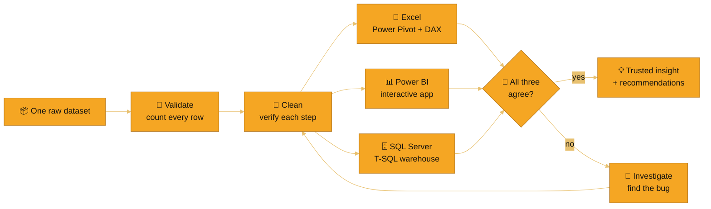

<!-- ═══════════════  OBSIDIAN & AMBER — PROFILE README  ═══════════════
     Assets expected in the profile repo:
       assets/banner.svg      (animated hero)
       assets/segments.svg    (animated revenue-share chart)
       .github/workflows/snake-amber.yml  (contribution snake, run once)
═══════════════════════════════════════════════════════════════════ -->

<div align="center">


<br>

<a href="https://shivanand-mathapati.vercel.app"></a>
<a href="https://www.linkedin.com/in/YOUR-LINKEDIN-HANDLE"></a>
<a href="mailto:shivanandmathapati350@gmail.com"></a>
<a href="https://YOUR-YOUTUBE-LINK"></a>

<br>


<br><br>

**[⚡ TL;DR](#-recruiter-tldr)** · **[🧭 Approach](#-signature-approach)** · **[🏆 Projects](#-featured-projects)** · **[🔬 Validation](#-cross-tool-validation)** · **[🐞 Bugs](#-bugs-i-caught-and-fixed)** · **[❓ FAQ](#-faq)** · **[🤝 Connect](#-lets-connect)**

</div>

---

## 🖥️ `whoami`

```bash
$ whoami
shivanand-mathapati            # data analyst · Belagavi, India

$ cat stack.txt
excel      ▸ power query · power pivot · dax · pivottables
sql server ▸ t-sql · window functions · recursive ctes · views · procs
power bi   ▸ star schema · 50+ dax measures · bookmark apps · drillthrough
tableau    ▸ dashboards (in progress)
python     ▸ learning

$ cat principles.txt
1. count the rows before you clean them, and after
2. rebuild it in a second tool and see if the answer holds
3. when a number looks wrong, find out why — don't report it
4. write down the bugs; they're the proof you did the work

$ git status
On branch main — currently building: HR Analytics (Power BI) 🚧
```

---

## ⚡ Recruiter TL;DR

> [!TIP]
> **30-second version:** Data Analyst (Excel · SQL Server · Power BI · DAX · Power Query) who builds every project **end to end** — raw CSV → validated data → star schema → analysis → recommendations — then **rebuilds it in a second and third tool to check the answer.**

| 🎯 What I deliver | 📊 Proof from my projects |
|---|---|
| Segmentation that finds the money | **23% of customers = 65.84% of revenue** across 541K transactions |
| Diagnosis, not just dashboards | Found *why* profit fell while sales grew — **$322K of discounts > $286K total profit** |
| Data I can defend | Row counts verified at **every** cleaning step: **541,909 → 401,560** |
| Judgment on messy data | Caught a **partial-month artifact** and a **bulk-order-then-cancel** anomaly *before* they reached a report |

---

## 📈 Where the Revenue Comes From

<div align="center">

</div>

---

## 🧭 Signature Approach

**Most portfolios build a project once. I rebuild the same business problem in three tools.** When three independent pipelines — built with different techniques — land on the same answer, that's validation no single tool can give.



---

## 🛠️ Skills — With Evidence

<p align="center">
  
</p>

| Skill | Where I used it | Proof |
|---|---|:-:|
| **Power Query (M)** | Cleaning, de-duplication, dimension splitting | Excel + Power BI builds |
| **Star-schema modeling** | 5-table models across all three tools | Power Pivot · Power BI · SQL `PK/FK` |
| **DAX** | `RANKX` scoring, Pareto curves, time intelligence, dynamic text | 49–50+ measures per Power BI build |
| **T-SQL window functions** | `NTILE(5)` RFM, `ROW_NUMBER` de-dup, running-total Pareto | SQL Server script |
| **Recursive CTEs** | Generated a calendar dimension from scratch | `Dim_Date` (374 rows) |
| **Stored procedures & views** | Reusable reporting layer | 26 views + 2 procedures |
| **BI app design** | Bookmark-driven single-page app, drillthrough, custom tooltips | Power BI Customer Segmentation |
| **Root-cause analysis** | Discount, category and state-level loss drivers | Superstore analysis |

---

## 🏆 Featured Projects

<table>
<tr>
<td width="33%" valign="top">

### 1️⃣ Customer Segmentation
`Excel` `Power BI` `SQL Server`

RFM analysis of **541K transactions** — who drives revenue, who's about to leave.

**4,371** customers · **£8.89M** revenue · **5** segments

✅ **Completed**

[**↓ Jump to details**](#1️⃣-customer-segmentation--revenue-intelligence)

</td>
<td width="33%" valign="top">

### 2️⃣ Superstore Sales
`Excel` `Power BI` `SQL Server`

Sales grew every year — so why did **profit margin fall**?

**9,994** rows · **$2.30M** sales · **26.3%** loss-making orders

✅ **Completed**

[**↓ Jump to details**](#2️⃣-superstore-sales-analysis--why-did-profit-decline)

</td>
<td width="33%" valign="top">

### 3️⃣ HR Analytics
`Power BI`

Why do employees leave — and **who is most likely to go next?**

IBM HR Attrition dataset

🚧 **Coming Soon**

[**↓ Jump to details**](#3️⃣-hr-analytics--employee-attrition)

</td>
</tr>
</table>

---

## 1️⃣ Customer Segmentation & Revenue Intelligence

<p>
  
  
  
  
</p>

🗓️ **Timeline:** `<start date>` → `<end date>`

| 💰 Revenue | 👥 Customers | 🏆 Concentration | ⚠️ Churn | 🚨 Revenue at risk |
|:-:|:-:|:-:|:-:|:-:|
| **£8.89M** gross<br>£8.28M net | **4,371**<br>5 RFM segments | **23%** of customers<br>drive **65.84%** of revenue | **33.9%**<br>inactive 90+ days | **£1.3M+**<br>At Risk + Lost |

<details open>
<summary><b>📖 Case study — Situation · Task · Action · Result</b></summary>
<br>

| | |
|---|---|
| **🧩 Situation** | A UK online retailer had 13 months of transactions and no clear view of who its valuable customers were, or who was about to leave. |
| **🎯 Task** | Segment customers by behavior (RFM), size the revenue at risk, and say where to spend retention effort. |
| **⚙️ Action** | Cleaned 541,909 rows → 401,560 with a verified count at every step; modeled a star schema; scored Recency / Frequency / Monetary in 1–5 quintiles; classified into 5 mutually exclusive segments; rebuilt it independently in 3 tools. |
| **🏁 Result** | Champions drive two-thirds of revenue; **34% of customers bought once and never returned** (a retention gap, not an acquisition gap); **£1.3M+** sits with disengaging customers; a 20% win-back would recover ≈ **£265K**. |

</details>

<details>
<summary><b>📗 Excel</b> — Power Query · Power Pivot · DAX</summary>
<br>

- **5-table star schema** in Power Pivot, **20+ DAX measures** (CLV, churn, retention, RFM scoring)
- Two slicer-driven dashboards + a dedicated **EDA** sheet + a **Business Insights & Actions** page (Finding → Insight → Action)

🔗 [View project](https://github.com/shivanand-Mathapati-Analyst/customer-segmentation-analysis)

</details>

<details>
<summary><b>📊 Power BI</b> — a single-page "app", not a stack of tabs</summary>
<br>

- **Bookmark-driven app:** fixed sidebar + persistent global slicers + **5 swappable views**
- **49 DAX measures** — `RANKX` scoring, Pareto curves, DAX-generated insight sentences
- **Drillthrough** customer page + **2 custom tooltip pages**; hand-built *"Obsidian & Amber"* theme — the same palette as this profile

🔗 [View project](https://github.com/shivanand-Mathapati-Analyst/YOUR-POWERBI-CUSTOMER-SEGMENTATION-REPO) · 🌐 [Live report](https://YOUR-POWER-BI-SERVICE-LINK)

</details>

<details>
<summary><b>🗄️ SQL Server</b> — T-SQL warehouse + reporting layer</summary>
<br>

- **3-schema design:** `original` → `datamodel` → `reporting`
- **`NTILE(5)` RFM engine**, **recursive-CTE** calendar table, **26 views + 2 stored procedures**
- Fully commented script ending in written *Findings → Root Causes → Insights → Recommendations*

🔗 [View project](https://github.com/shivanand-Mathapati-Analyst/YOUR-SQL-CUSTOMER-SEGMENTATION-REPO)

</details>

---

## 2️⃣ Superstore Sales Analysis — *Why Did Profit Decline?*

<p>
  
  
  
</p>

🗓️ **Timeline:** `<start date>` → `<end date>`

| 💰 Scale | 📉 The paradox | ⚠️ The leak | 🏷️ The cause |
|:-:|:-:|:-:|:-:|
| **$2.30M** sales<br>**$286K** profit | Margin **13.4% → 12.7%** while sales grew 20%+ | **26.3%** of orders (1,318 / 5,009) lost money | **$322.58K** in discounts — *more than total profit* |

- 📉 **Discounts above 30% turn margin negative**; above 50% it hits **−119%**
- 🪑 **Furniture (Tables & Bookcases)** is structurally unprofitable despite the highest average discount
- 🗺️ Texas, Ohio, Colorado, Illinois and Pennsylvania drive most losses

<details>
<summary><b>🧩 Excel · Power BI · SQL Server versions</b></summary>
<br>

| Version | Highlights | Link |
|---|---|---|
| 📗 **Excel** | MoM & YoY analysis, 12+ KPIs, slicer dashboard — reporting time cut from hours to minutes | [Repo](https://github.com/shivanand-Mathapati-Analyst/excel-superstore-sales-analysis) |
| 📊 **Power BI** | 6 pages + 3 tooltip pages, 50+ DAX measures, dynamic titles & DAX-written insight callouts | [Repo](https://github.com/shivanand-Mathapati-Analyst/powerbi-sales-analysis-project) |
| 🗄️ **SQL Server** | The same business problem in native T-SQL | [Repo](https://github.com/shivanand-Mathapati-Analyst/sql-superstore-sales-analysis) |

</details>

---

## 3️⃣ HR Analytics — Employee Attrition

<p>
  
  
  
</p>

🧠 **The question:** *Why do employees leave — and who is most likely to go next?*

| 🔭 Planned focus | What it will answer |
|---|---|
| **Attrition drivers** | Which factors (overtime, tenure, income, role, satisfaction) most strongly predict leaving? |
| **Workforce risk** | Which departments and roles carry the most attrition exposure? |
| **Employee profile** | What does a flight-risk employee look like versus a retained one? |
| **Actionable levers** | Where can HR intervene for the biggest retention impact? |

> [!NOTE]
> Built to cover the full breadth of Power BI — and to look unlike a typical portfolio dashboard. **Star this profile to follow along.**

---

## 🔬 Cross-Tool Validation

Same dataset, same methodology, **built independently** — here's how the Customer Segmentation numbers line up:

| Metric | 📗 Excel | 🗄️ SQL Server | 📊 Power BI |
|---|:-:|:-:|:-:|
| Total customers | 4,371 | 4,371 | 4,371 |
| Gross revenue | £8.89M | £8.89M | `[fill in]` |
| Net revenue (after returns) | £8.28M | £8.28M | `[fill in]` |
| Champions — customers | 1,009 | 1,009 | `[fill in]` |
| Champions — share of revenue | 65.84% | 65.84% | `[fill in]` |
| Churn rate (90+ days inactive) | 33.91% | 33.9% | `[fill in]` |

> Tiny differences (e.g. ±1 customer at a segment boundary) come from tie-breaking in each tool's ranking logic — documented, not hidden.

---

## 🐞 Bugs I Caught and Fixed

<details>
<summary><b>The real problems I hit while building — and how I diagnosed them</b></summary>
<br>

| 🐛 Bug | 🔍 How I found it | 🛠️ Fix |
|---|---|---|
| **UK dates misread** — `ALTER COLUMN` to `DATETIME` failed "out-of-range" | Raw dates are `dd-mm-yyyy`; the server assumed `us_english` | `SET DATEFORMAT dmy` before casting |
| **Customers silently dropped** — 33 customers had `NULL` RFM values | A `NULL` check returned 33, not 0; they only had cancelled orders | `INNER JOIN` → `LEFT JOIN` + `COALESCE` fallbacks |
| **Return-only customers scored "Potential Loyalists"** in Power BI | DAX `RANKX` sorts `BLANK()` as the smallest value → accidental top Recency score | Gave blank-Recency customers an honest worst-case value |
| **Inflated revenue %** in a SQL view | Joined a customer-level `Monetary` to the fact table → summed once per transaction (fan-out join) | Aggregate customer-level fields from the dimension, with no join |
| **Impossible segment counts** (Lost + At Risk > the R≤2 pool) | Pool-size arithmetic didn't add up | A `>=` typo that should have been `<=` |
| **Duplicates left in Power BI** | Cross-tool row count disagreed with SQL | Added a de-duplication step upstream |
| **#1 product was a mirage** | One SKU topped both "best-selling" and "most-returned" at 80,995 units | One customer bought and fully cancelled it — flagged, not ranked |
| **December "collapse"** | Dataset ends 9 Dec — a partial month | Footnoted as a data-boundary artifact |

</details>

---

## ❓ FAQ

<details>
<summary><b>Why rebuild the same project three times?</b></summary>
<br>
Each tool answers a different workplace question — Excel is what stakeholders already have open, Power BI is for interactive decision-facing reporting, and SQL Server is where the logic lives when it needs to be reusable. Building all three also lets me cross-check results: if independent pipelines agree, the answer is trustworthy.
</details>

<details>
<summary><b>How do you validate your numbers?</b></summary>
<br>
I record a row count before and after every cleaning step, reconcile segment totals against the pool sizes they must add up to, and compare headline figures across tools. When something doesn't tie out, I treat it as a bug to diagnose — see the table above.
</details>

<details>
<summary><b>What are you looking for?</b></summary>
<br>
Data Analyst, Business Analyst, Power BI Developer or MIS Executive roles — internships, freelance and full-time all welcome.
</details>

---

## 🗺️ Roadmap

- [x] Customer Segmentation — Excel · Power BI · SQL Server
- [x] Superstore Sales Analysis — Excel · Power BI · SQL Server
- [ ] 🚧 HR Analytics — Employee Attrition (Power BI)
- [ ] 🚧 *Midnight Analytics* — executive dashboard (Tableau)
- [ ] 🐍 Python for advanced analytics — EDA & automation

---

## 🎓 Certification

<p align="center">
  
  
  
</p>

📚 Data Cleaning · EDA · SQL · Visualization · Capstone &nbsp;·&nbsp; 🛠️ Excel, SQL, Tableau, R &nbsp;·&nbsp; 🔗 [View credential](https://coursera.org/share/c9135167c520baa7ddaad2d78e86b0df)

---

## 📊 GitHub Activity

<p align="center">
  <picture>
    <source media="(prefers-color-scheme: light)" srcset="https://github-readme-stats.vercel.app/api?username=shivanand-Mathapati-Analyst&show_icons=true&hide_border=false&count_private=true&bg_color=FFF8EC&title_color=B7791F&icon_color=D98E04&text_color=3B2F1A&border_color=E8D9B5">
    
  </picture>
  <picture>
    <source media="(prefers-color-scheme: light)" srcset="https://github-readme-stats.vercel.app/api/top-langs/?username=shivanand-Mathapati-Analyst&layout=compact&bg_color=FFF8EC&title_color=B7791F&text_color=3B2F1A&border_color=E8D9B5">
    
  </picture>
</p>

<p align="center">
  
</p>

<!-- Contribution snake — needs .github/workflows/snake-amber.yml to have run once -->
<p align="center">
  <picture>
    <source media="(prefers-color-scheme: dark)" srcset="https://raw.githubusercontent.com/shivanand-Mathapati-Analyst/shivanand-Mathapati-Analyst/output/github-snake-dark.svg">
    
  </picture>
</p>

---

## 🤝 Let's Connect

<p align="center">
  <a href="https://www.linkedin.com/in/YOUR-LINKEDIN-HANDLE"></a>
  <a href="mailto:shivanandmathapati350@gmail.com"></a>
  <a href="https://shivanand-mathapati.vercel.app"></a>
</p>

<div align="center">

### 🚀 Open to Data Analyst roles · internships · freelance · full-time

⭐ **Consistently learning, building & improving in Data Analytics** ⭐


</div>
